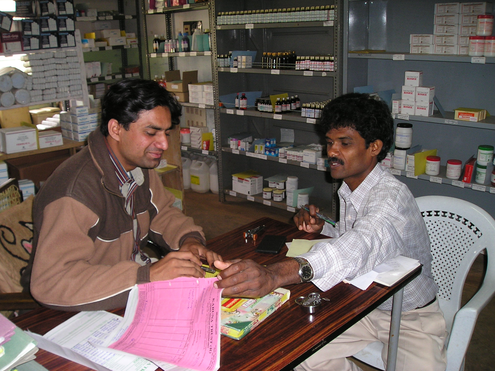

# Jaaved and Basappa
Jaaved, a young pharmacist joined VGKK hospital sometime in mid-2000s. Basappa was already there by then. Having a trained pharmacist was relatively a new experience. We split up the main store & the dispensing room. This one is the room near what would become the OT later on...Basappa was a multitasker, lending a hand at many things and being very systematic about things that he’d take on...Jaaved, I lost touch for a bit and around 2007/8 types, I think he was briefly in Kannur PHC in Bijapur which was managed by KT....

Date: 2002-12-31 14:00:00+00:00

---
Last updated: 2025-12-30 16:02

---
Last updated: 2025-12-30 16:03
