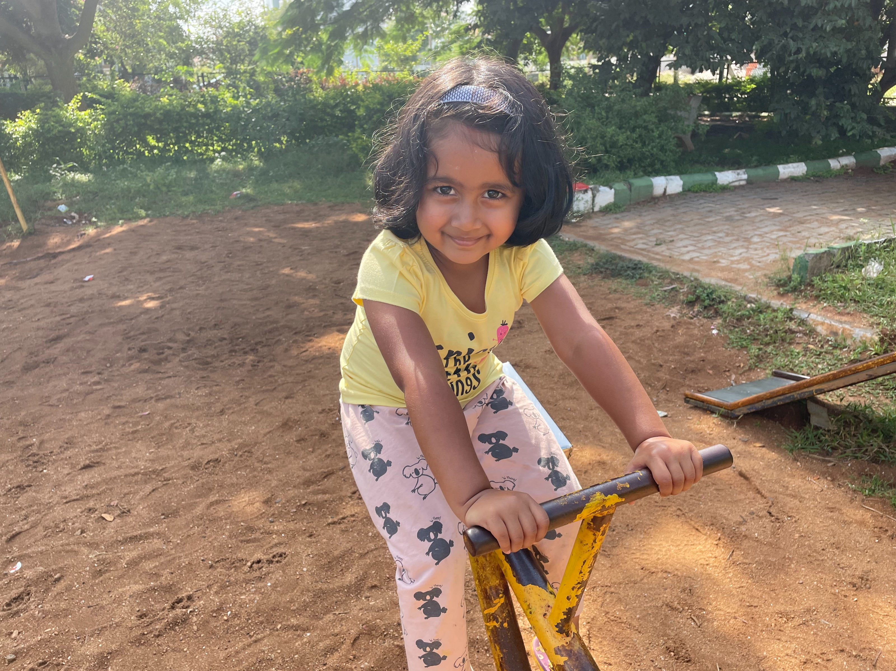
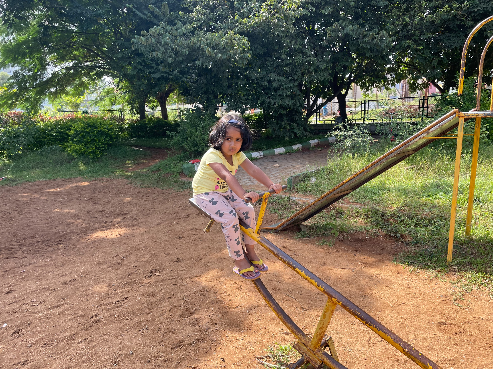
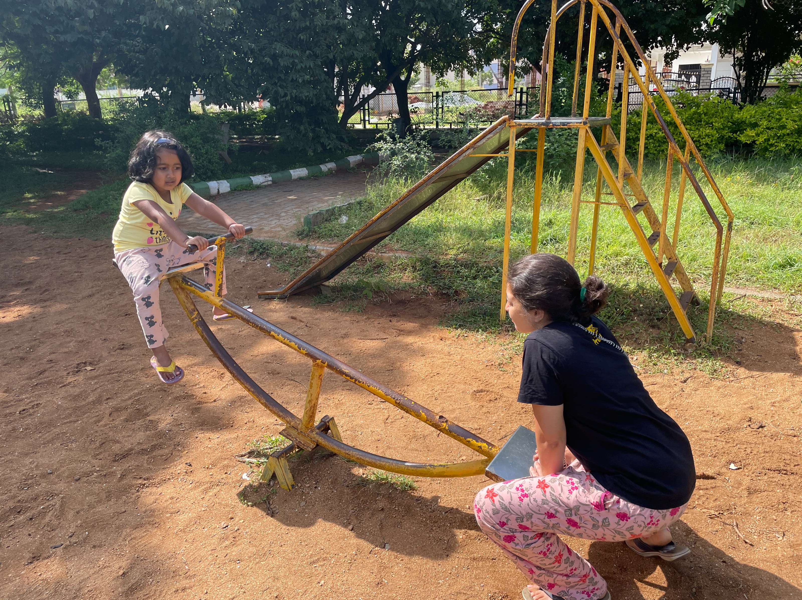
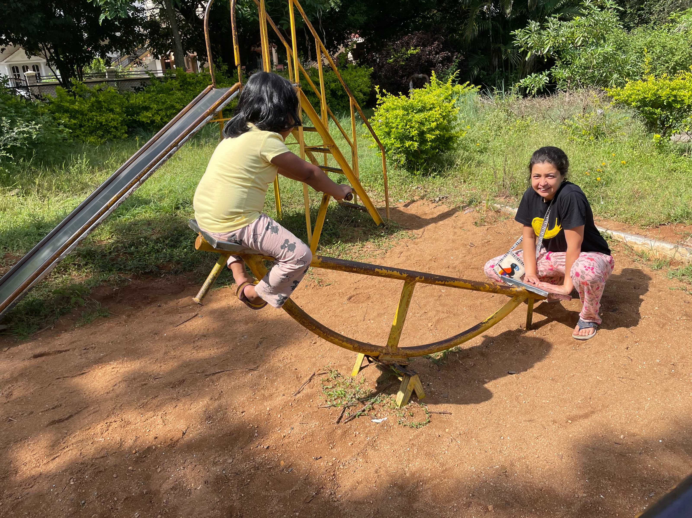
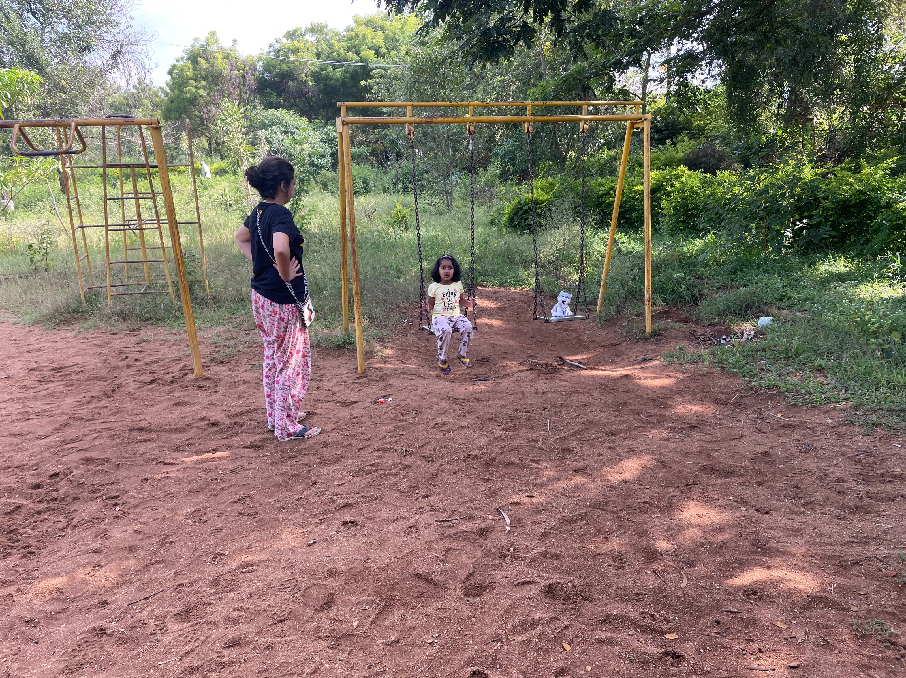

Slow day at the park with Deepika and Momo; yesterday and today were supposed to be slow days in mysore since I’ve been complaining of stress. Tanya converging Gundlupet tribal villages for vaccination.

Date: 2021-08-23 03:59:41+00:00

Date: 2021-08-23 03:59:34+00:00

Date: 2021-08-23 03:59:15+00:00

Date: 2021-08-23 03:59:09+00:00

Date: 2021-08-23 03:56:13+00:00

[20th Cross Road, Mysuru, KA, India](https://www.google.com/maps/search/?api=1&query=12.314245223999023,76.60514068603516)

---
Last updated: 2025-12-30 16:02

---
Last updated: 2025-12-30 16:03
