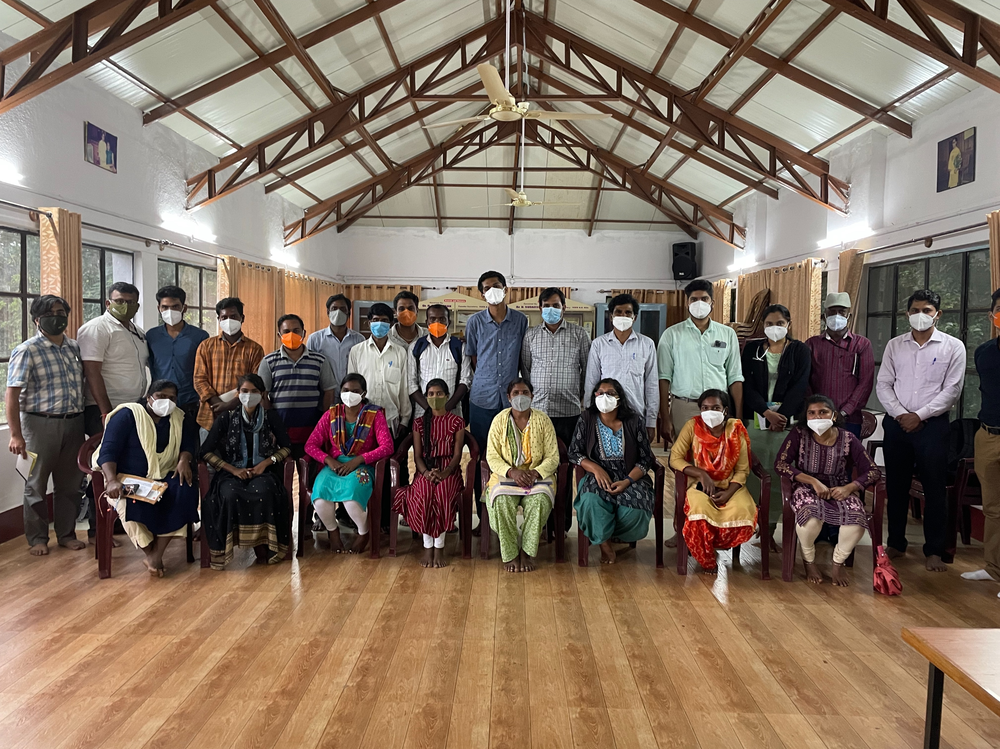
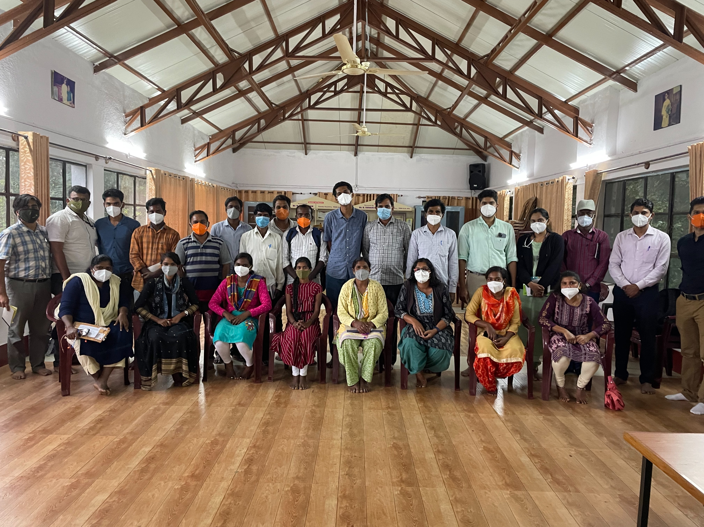
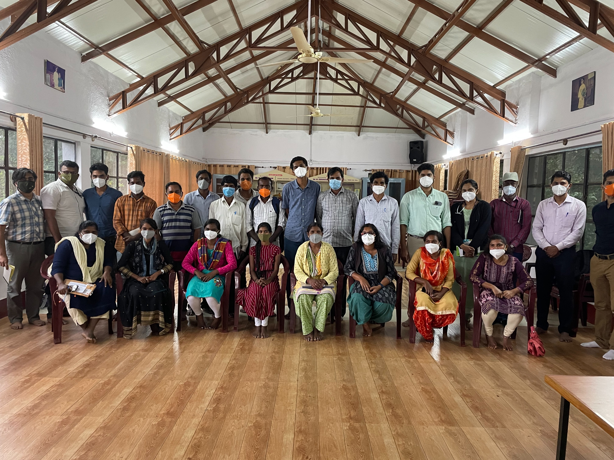
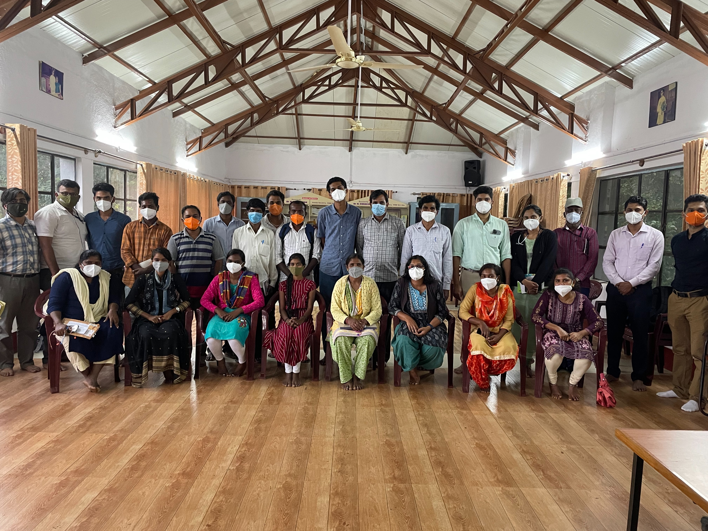
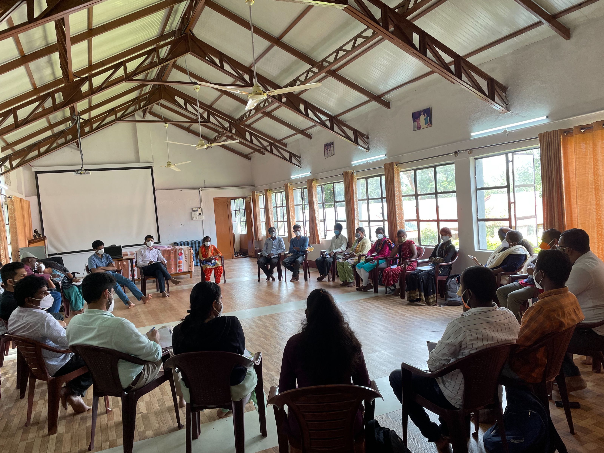
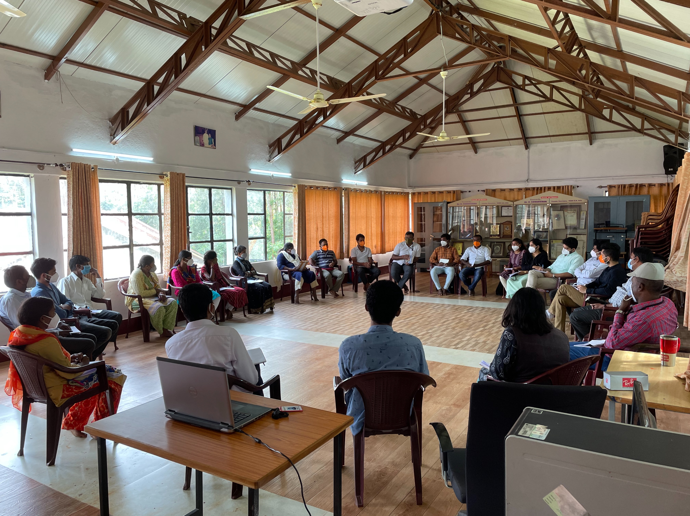
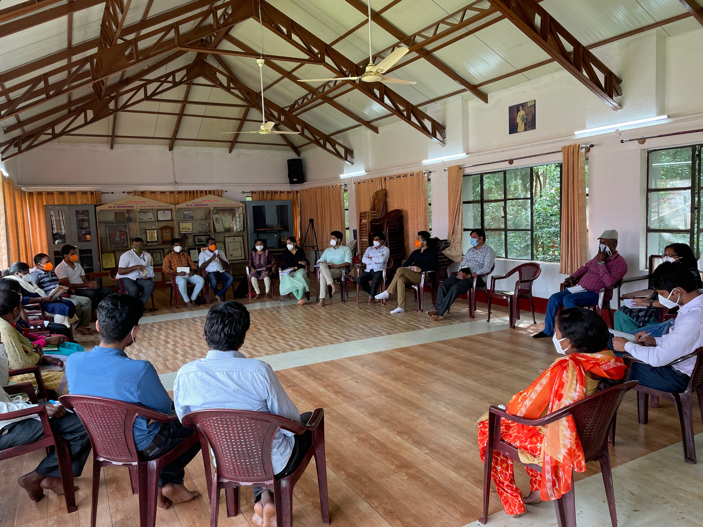

Monthly meeting at Brh before I left for blore for iph annual day

Date: 2021-09-02 10:48:23+00:00

Date: 2021-09-02 10:48:21+00:00

Date: 2021-09-02 10:48:19+00:00

Date: 2021-09-02 10:48:17+00:00

Date: 2021-09-02 09:31:46+00:00

Date: 2021-09-02 09:31:23+00:00

Date: 2021-09-02 09:31:12+00:00

[Biligiri Rangaswamy Wildlife Sanctuary, Chamarajanagara, KA, India](https://www.google.com/maps/search/?api=1&query=11.982966423034668,77.14156341552734)

---
Last updated: 2025-12-30 16:02

---
Last updated: 2025-12-30 16:03
