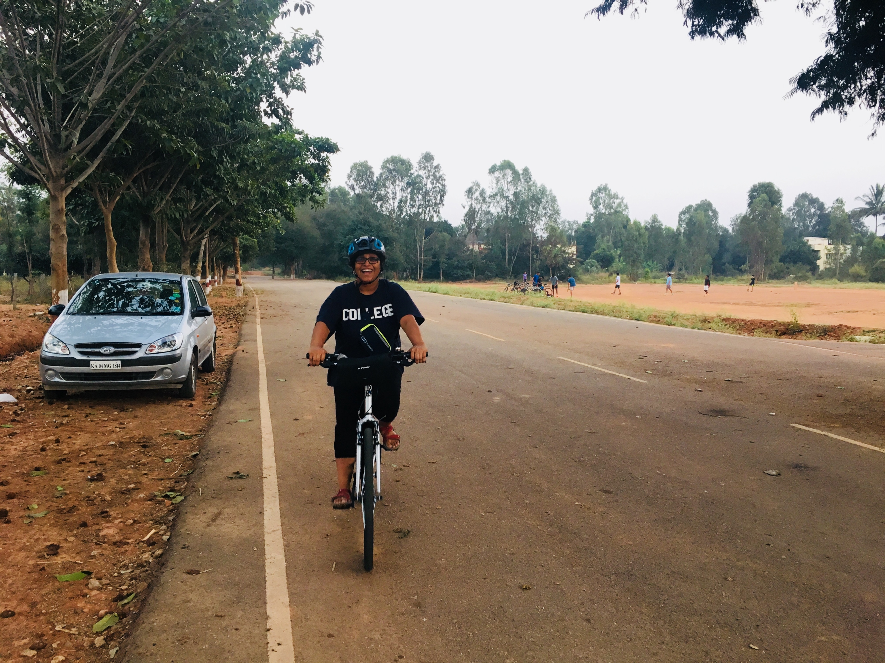
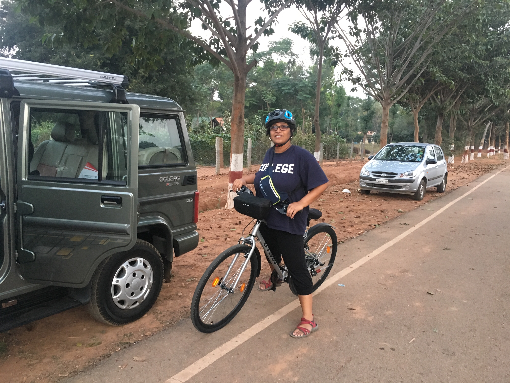

Mommy’s cycling day out with Monal and moo

Date: 1970-01-01 00:00:00+00:00

Date: 1970-01-01 00:00:00+00:00

[Gandhi Krishi Vignan Kendra (University of Agricultural Sciences) - GKVK, Bengaluru, Karnataka, India](https://www.google.com/maps/search/?api=1&query=13.084869384765625,77.58065032958984)

---
Last updated: 2025-12-30 16:02

---
Last updated: 2025-12-30 16:03
